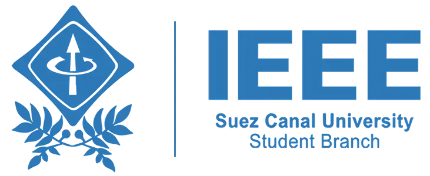

# IEEE SCU Student Branch Website

<div align="center">



**Official website for IEEE Suez Canal University Student Branch**

[](https://nextjs.org/)
[](https://www.typescriptlang.org/)
[](https://tailwindcss.com/)
[](https://vercel.com/)

🏆 **Winner of 2025 Egypt Section Outstanding Student Branch Website Award**

[Live Website](https://ieeescu.org) | [IEEE SCU Branch](https://www.facebook.com/IEEESCU) | [Contact Us](mailto:scu@ieee.org.eg)

</div>

## 🌟 About IEEE SCU Student Branch

IEEE Suez Canal University Student Branch is a dynamic organization established in 2012, based in Ismailia. We are part of the Egypt Section within
IEEE Region 8, providing a work-like environment where students take on real responsibilities, meet deadlines, and grow into leadership roles through
workshops, bootcamps, competitions, and talks.

### 📊 Our Impact

- **220+** Active Members
- **40+** Technical Events
- **11** Active Committees
- **10+** Years of Excellence

## 🚀 Features

### 🎯 Core Pages

- **Home**: Interactive landing page with statistics, officer profiles, and achievements
- **About**: Comprehensive information about IEEE, Region 8, Egypt Section, and our branch
- **Committees**: Detailed overview of 11 technical and non-technical committees
- **Events**: Latest and upcoming events showcase
- **Join**: Recruitment information and application process
- **Contact**: Branch contact information and location
- **Developers**: Meet the webmasters and technology stack

### 🏗️ Technical Committees

- **Web Development**: Full-stack web development and modern frameworks
- **AI**: Artificial intelligence, machine learning, and data science
- **Cyber Security**: Digital security, penetration testing, and ethical hacking
- **Robotics**: Embedded systems, IoT, and robotics competitions
- **Flutter**: Cross-platform mobile application development
- **DevOps & Cloud**: Cloud computing, CI/CD, and automation

### 🎨 Non-Technical Committees

- **Media**: Visual content creation and digital marketing
- **Human Resources**: Team management and professional development
- **Public Relations & Fundraising**: External partnerships and communication
- **Event Coordination**: Workshop and event management
- **Entrepreneurship**: Innovation and business development

### ⚡ Technical Features

- **Server-Side Rendering (SSR)**: Fast page loads and SEO optimization
- **Static Site Generation (SSG)**: Pre-built pages for optimal performance
- **Dynamic Metadata**: SEO-optimized meta tags for each page
- **Structured Data**: JSON-LD schema for rich search results
- **Image Optimization**: WebP/AVIF formats with responsive sizing
- **Dark Mode**: System-aware theme switching
- **Responsive Design**: Mobile-first approach with Tailwind CSS
- **Performance Monitoring**: Vercel Analytics and Speed Insights
- **Accessibility**: WCAG compliant with semantic HTML

## 🛠️ Technology Stack

### Frontend

- **[Next.js 15.5.4](https://nextjs.org/)** - React framework with App Router
- **[React 19.1.1](https://react.dev/)** - UI library with latest features
- **[TypeScript 5.9.2](https://www.typescriptlang.org/)** - Type-safe development
- **[Tailwind CSS 3.4.17](https://tailwindcss.com/)** - Utility-first CSS framework

### Styling & UI

- **[Heroicons](https://heroicons.com/)** - Beautiful SVG icons
- **Custom CSS Variables** - Dynamic theming system
- **Tailwind Animations** - Smooth transitions and interactions

### Performance & Analytics

- **[Vercel Analytics](https://vercel.com/analytics)** - Real-time performance insights
- **[Vercel Speed Insights](https://vercel.com/docs/speed-insights)** - Core Web Vitals monitoring
- **[Next.js Image Optimization](https://nextjs.org/docs/app/api-reference/components/image)** - Automatic image optimization

### SEO & Marketing

- **[next-sitemap](https://github.com/iamvishnusankar/next-sitemap)** - Automatic sitemap generation
- **Structured Data** - Schema.org markup for rich snippets
- **Open Graph & Twitter Cards** - Social media optimization

### Development Tools

- **[ESLint](https://eslint.org/)** - Code linting and quality
- **[PostCSS](https://postcss.org/)** - CSS processing
- **[PNPM](https://pnpm.io/)** - Fast, disk space efficient package manager

## 📁 Project Structure

```
ieee-scu-sb-website/
├── src/
│   ├── app/                    # Next.js App Router pages
│   │   ├── about/             # About page
│   │   ├── committees/        # Committees pages
│   │   │   └── [id]/         # Dynamic committee detail pages
│   │   ├── contact/          # Contact page
│   │   ├── developers/       # Developers page
│   │   ├── events/           # Events page
│   │   ├── join/             # Join page
│   │   ├── layout.tsx        # Root layout
│   │   └── page.tsx          # Home page
│   ├── components/           # Reusable React components
│   │   ├── committees/       # Committee-specific components
│   │   ├── contact/          # Contact page components
│   │   ├── events/           # Event components
│   │   └── home/             # Home page sections
│   ├── data/                 # Data layer and type definitions
│   │   ├── aboutSections.ts  # About page content
│   │   ├── awards.ts         # Achievement data
│   │   ├── board.ts          # Committee heads and members
│   │   ├── committees.ts     # Committee information
│   │   ├── events.ts         # Event data
│   │   ├── officers.ts       # High board officers
│   │   └── types.ts          # TypeScript interfaces
│   ├── assets/               # Static assets
│   │   ├── board/           # Committee head photos
│   │   ├── events/          # Event images
│   │   ├── illustrations/   # SVG illustrations
│   │   └── logos/           # Brand logos
│   └── hooks/               # Custom React hooks
├── public/                  # Public static files
│   ├── favicon.ico         # Website favicon
│   ├── robots.txt          # Search engine directives
│   └── sitemap.xml         # XML sitemap
├── next.config.mjs         # Next.js configuration
├── tailwind.config.ts      # Tailwind CSS configuration
└── package.json           # Project dependencies
```

## 🚀 Getting Started

### Prerequisites

- **Node.js** 18.17 or later
- **PNPM** (recommended) or npm/yarn

### Installation

1. **Clone the repository**

   ```bash
   git clone https://github.com/IEEE-SCU-SB/ieee-scu-sb-website.git
   cd ieee-scu-sb-website
   ```

2. **Install dependencies**

   ```bash
   pnpm install
   # or
   npm install
   ```

3. **Start development server**

   ```bash
   pnpm dev
   # or
   npm run dev
   ```

4. **Open your browser** Navigate to [http://localhost:3000](http://localhost:3000)

### Available Scripts

```bash
# Development
pnpm dev          # Start development server
pnpm build        # Build for production
pnpm start        # Start production server
pnpm lint         # Run ESLint

# Build includes automatic sitemap generation
pnpm postbuild    # Runs after build to generate sitemap
```

## 📝 Content Management

### Adding New Committee Members

1. **Update committee data** in `src/data/committees.ts`
2. **Add board member info** in `src/data/board.ts`
3. **Add member photos** to `src/assets/board/`
4. **Update types** if needed in `src/data/types.ts`

### Adding New Events

1. **Add event data** to `src/data/events.ts`
2. **Upload event images** to `src/assets/events/`
3. **Update categories** (technical/non-technical)

### Managing Officers

1. **Update officer info** in `src/data/officers.ts`
2. **Add photos** to `src/assets/highboard/`

## 📱 Browser Support

- **Chrome** 90+
- **Firefox** 88+
- **Safari** 14+
- **Edge** 90+
- **Mobile browsers** (iOS Safari, Chrome Mobile)

## 🏆 Awards & Recognition

- **2025 Egypt Section Outstanding Student Branch Website Award** - Recognized for excellence in usability, accessibility, content, presentation,
  navigability, originality, and portability

## 📞 Contact & Support

### IEEE SCU Student Branch

- **Email**: [scu@ieee.org.eg](mailto:scu@ieee.org.eg)
- **Phone**: +20 120 654 7195
- **Location**: Faculty of Engineering, Suez Canal University, Ismailia

### PR & Marketing

- **Email**: [ieee.scu.pr@gmail.com](mailto:ieee.scu.pr@gmail.com)
- **Phone**: +20 112 246 1100

### Social Media

- **Facebook**: [@IEEESCU](https://www.facebook.com/IEEESCU)
- **Instagram**: [@ieee_scu_sb](https://www.instagram.com/ieee_scu_sb)
- **LinkedIn**: [IEEE SCU Student Branch](https://www.linkedin.com/company/ieee-suez-canal-university-student-branch)
- **TikTok**: [@ieeescu24](https://www.tiktok.com/@ieeescu24)

### Website Development Team

- **Current Webmaster**: [Mohamed Alsaeed](https://www.linkedin.com/in/saeedinum) (Sep 2025 - present)
- **Previous Webmaster**: [Mostafa Hashem](https://www.linkedin.com/in/mostafaaa-hashem) (Sep 2024 - Aug 2025)

## 📄 License

This project is part of IEEE SCU Student Branch's digital initiatives. All rights reserved.

---

<div align="center">

**Built with ❤️ by IEEE SCU Student Branch Webmasters**

[Visit Our Website](https://ieeescu.org) • [Join IEEE SCU](https://ieeescu.org/join) • [View Committees](https://ieeescu.org/committees)

</div>
# ieee-scu-sb-website
